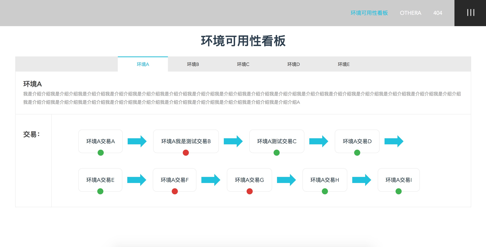

# 运用vue2.0构建环境可用性看板
[TOC]

## 1.描述
写这个项目的目的一是帮栾大哥，二是为了学习vue

主要技术选型：
- vue2.0
- vue-router
- vuex
- mint-ui
- nodejs

## 2.环境准备
安装node.js
下载地址：https://nodejs.org/en/download/

node安装成功后，命令行全局安装webpack

```
npm install -g webpack
```

命令行全局安装vue

```
npm install -g vue-cli
```

## 3.如何运行
打开终端进入到env_tools目录,安装依赖包

```
npm install
```

启动前端开发服务，在env_tools目录里执行以下命令，成功执行后，会自动打开浏览器访问前端开发环境，浏览地址是:http://localhost:8080

```
npm run dev
```

备注：接入代理数据后，可将文件data.json模拟数据删除；

## 4.项目预览


## 5.主要目录结构
> build
> config 
> src          // 前端主要开发目录
> --assets     // 存放前端静态资源
> --components // 存放组件
> --store      // vuex数据流管理
> --views      // 页面视图，由vue-router引入
> --App.vue    // 总组件
> --main.js    // 前端入口文件

## 6.前端文件
环境可用性看板功能前端代码主要在views --> HomeEnvironmentBoard.vue下,针对此文件需了解：

1.交易状态默认样式为红色（未成功），绿色（成功,className: success），当前假数据设置的是trade.status:1代表成功，具体按项目实际参数再做修改；

```
<span class="sign-icon" v-bind:class="{ success: trade.status == 1 }"></span>
```

2.修改环境名称及环境描述需改此位置（当前按写死数据的方式，如需自由配置，自行修改－－！）：

```
data () {
   return {
       selectedId: 1, // 默认选择环境1
       options: [ // 下拉框方式数据（选其一即可），环境名称
           { name: '环境A', value: 1 },
           { name: '环境B', value: 2 },
           { name: '环境C', value: 3 },
           { name: '环境D', value: 4 },
           { name: '环境E', value: 5 }
       ],
       envList: [ // 选项卡方式数据（选其一即可），环境名称
           { id: 1, name: '环境A', showOn: true },
           { id: 2, name: '环境B', showOn: false },
           { id: 3, name: '环境C', showOn: false },
           { id: 4, name: '环境D', showOn: false },
           { id: 5, name: '环境E', showOn: false }
       ],
       introList: [ // 环境描述
           { name: '环境A', des: '我是介绍介绍我是介绍介绍我是介绍介绍我是介绍介绍我是介绍介绍我是介绍介绍我是介绍介绍我是介绍介绍我是介绍介绍我是介绍介绍我是介绍介绍我是介绍介绍我是介绍介绍我是介绍介绍我是介绍介绍我是介绍介绍我是介绍介绍我是介绍介绍我是介绍介绍我是介绍介绍我是介绍介绍我是介绍介绍我是介绍介绍我是介绍介绍我是介绍介绍我是介绍介绍A', isShow: true },
           { name: '环境B', des: '我是介绍介绍我是介绍介绍我是介绍介绍我是介绍介绍我是介绍介绍我是介绍介绍我是介绍介绍我是介绍介绍B', isShow: false },
           { name: '环境C', des: '我是介绍介绍我是介绍介绍我是介绍介绍我是介绍介绍我是介绍介绍我是介绍介绍我是介绍介绍我是介绍介绍C', isShow: false },
           { name: '环境D', des: '我是介绍介绍我是介绍介绍我是介绍介绍我是介绍介绍我是介绍介绍我是介绍介绍我是介绍介绍我是介绍介绍D', isShow: false },
           { name: '环境E', des: '我是介绍介绍我是介绍介绍我是介绍介绍我是介绍介绍我是介绍介绍我是介绍介绍我是介绍介绍我是介绍介绍我是介绍介绍我是介绍介绍我是介绍介绍我是介绍介绍我是介绍介绍我是介绍介绍我是介绍介绍我是介绍介绍我是介绍介绍我是介绍介绍E', isShow: false }
       ],
       tradeList: [] // 交易
   }
},
```

## 7.后台接口
配置后端接口说明：
1.在项目config目录下index.js文件中，将后端服务地址配置到proyTable中，如下：

```
proxyTable: {
   '/api': {
       target: 'http://ip:port',  // 传入后端接入数据服务器地址
       changeOrigin: true
   }
}
```

2.然后在src-->views-->HomeEnvironmentBoard.vue文件中写入接口路径，如下：

```
this.requestData('/api/path', { // 传入后端接口路径
    key: value   // 接口参数配置
}, (response) => {
    let data = response.data
    this.tradeList = data[...]  // 接口返回数据格式自行配置
})
```

> PS:以上默认接口请求方式method是：GET，如需设置为POST，可以修改当前文件methods方法中的requestData方法为

```
requestData (url, params, fn) {
  this.pushLoadStack()
  this.$http.post(url, params).then(fn).then(this.completeLoad)
}
```

> 或者弃用methods中定义的requestData方法，将init方法直接改写为：

```
init () {
    this.pushLoadStack()
    this.$http.post('/api/path', { // 传入后端接口路径
        key: value   // 接口参数配置
    }).then((response) => {
      let data = response.data
      this.tradeList = data[...] // 接口返回数据格式自行配置
    }).then(this.completeLoad)
}
```


## Build Setup

``` bash
# install dependencies
npm install

# serve with hot reload at localhost:8080
npm run dev

# build for production with minification
npm run build

# build for production and view the bundle analyzer report
npm run build --report

# run unit tests
npm run unit

# run e2e tests
npm run e2e

# run all tests
npm test
```

For a detailed explanation on how things work, check out the [guide](http://vuejs-templates.github.io/webpack/) and [docs for vue-loader](http://vuejs.github.io/vue-loader).
